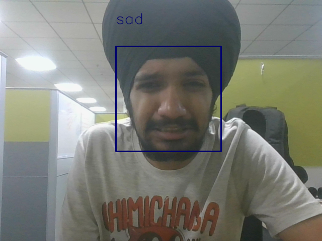

# eMojify
Emotion Recognition from Facial Expressions using Deep Learning

Pre-trained model is provided.

Run predict.py to classify Facial Expressions.

Requires OpenCV and haarcascade_frontalface.xml to Detect Faces.

Sample Predictions:

